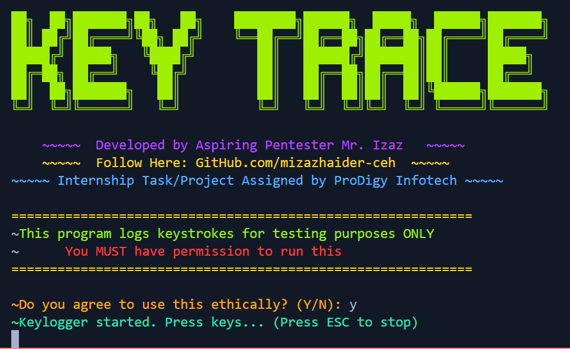
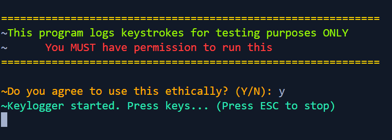
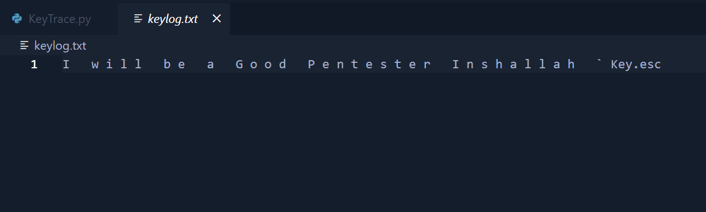
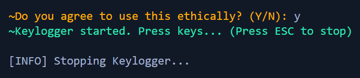

# KeyTrace - Ethical Keylogger 🖥️


## **Developed by:** Muhammad Izaz Haider

**Internship Project at:** Prodigy InfoTech

## 📌 **Overview**

**KeyTrace** is an ethical keystroke logging tool designed for testing purposes only. This program captures and logs keystrokes with user consent and saves them to a file. It serves as a demonstration of logging techniques while ensuring ethical compliance and transparency.

## 🛠 **How KeyTrace Works**

KeyTrace records key presses and logs them into a text file (`keylog.txt`). It includes the following features:

✔️ Logs all keystrokes (excluding special keys like Shift, Ctrl, etc.)

✔️ Saves keystrokes to an external file (`keylog.txt`)

✔️ Displays a **banner and user consent prompt** before running

✔️ Stops logging when the user presses the `ESC` key

✔️ Fully ethical and requires user permission

## 📌 **Features**

✅ Ethical and transparent keylogging (requires user consent)

✅ Simple and lightweight Python script

✅ Cross-platform compatibility (Windows, Linux, macOS)

✅ Ignores unnecessary keys (Shift, Ctrl, Alt, etc.)

✅ Safe for educational and testing purposes

## 📂 **Project Structure**

```
PRODIGY_CS_03-KeyTrace/
│── KeyTrace.py         # Main Python script
│── README.md           # Project documentation
│── screenshots/        # Folder containing example outputs
│   │── logo.png        # Project logo
│   │── log.png         # Example of key logging
│   │── working.png     # KeyTrace in action
│   │── stopping.png    # Stopping the keylogger
```

## 🖥 **Screenshots**

### **🔹 Project Logo:**


### **🔹 KeyTrace Running:**



### **🔹 Key Logging in Action:**



### **🔹 Stopping the Keylogger:**



## 🎯 **Why I Built This Project**

This project was developed as part of my internship at **Prodigy InfoTech** to explore keystroke logging in a controlled, ethical, and educational manner. It reinforced my understanding of Python event handling, file operations, and cybersecurity best practices.

## 📚 **What I Learned**

✔️ Ethical considerations in keylogging

✔️ Python event-driven programming (pynput library)

✔️ File handling and logging techniques

✔️ User input validation and script automation

## 🛠 **Installation & Usage**

### **🔹 Prerequisites**

Ensure you have **Python 3.x** installed.

### **🔹 Clone the Repository**

```bash
git clone https://github.com/mizazhaider-ceh/PRODIGY_CS_03-KeyTrace.git
cd PRODIGY_CS_03-KeyTrace
```

### **🔹 Install Dependencies**

Install the required Python package:

```bash
pip install pynput
```

### **🔹 Run the Program**

✅ **On Windows:**

```bash
python KeyTrace.py
```

✅ **On Linux/macOS:**

```bash
python3 KeyTrace.py
```

## 🔹 **Usage Instructions**

1️⃣ The program will display a **banner** and ask for  **user consent** .

2️⃣ If the user agrees (`Y`), logging will start.

3️⃣ Keystrokes will be saved in  **keylog.txt** .

4️⃣ Press `ESC` to stop the logger.

## 🌟 **Special Thanks**

A huge thanks to **Prodigy InfoTech** for providing this internship opportunity, allowing me to apply ethical hacking and Python skills in real-world projects.

## 🏆 **The Project Ends... But The Journey Begins!**

If you like this project, consider giving it a ⭐ on  **GitHub** !

🔗 [GitHub Repository](https://github.com/mizazhaider-ceh/PRODIGY_CS_03-KeyTrace)

## 📜 **License**

This project is open-source and available under the  **MIT  [LICENSE](LICENSE)** .

## 📬 **Connect with Me**

* **GitHub:** [mizazhaider-ceh](https://github.com/mizazhaider-ceh)
* **LinkedIn:** [Muhammad Izaz Haider](https://www.linkedin.com/in/muhammad-izaz-haider-091639314/)
* **Email:** [mizazhaider@gmail.com](mailto:mizazhaider@gmail.com)
